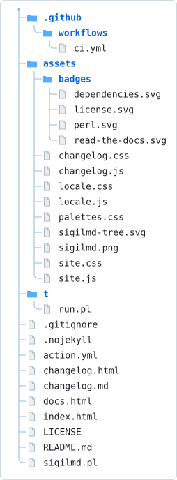

<p align="center"></p>

# sigilmd

[](https://github.com/lucianofedericopereira/sigilmd/actions/workflows/ci.yml) <!--[[ badge: id=license label="License" message="MIT" color=2563EB style=flat link="LICENSE" ]]--><a href="LICENSE"></a><!--/--> <!--[[ badge: id=perl label="Perl" message="5.8+" color=2563EB style=flat link="sigilmd.pl" ]]--><a href="sigilmd.pl"></a><!--/--> <!--[[ badge: id=dependencies label="CPAN dependencies" message="0" color=2563EB style=flat link="sigilmd.pl" ]]--><a href="sigilmd.pl"></a><!--/-->

Insert file contents and config-defined values into `README.md` using marker
comments. No template language, no CPAN dependencies, one Perl script.

## Project structure

Kept current by [treegen2](https://github.com/lucianofedericopereira/treegen2) — `color="blue"` matches this project's own branding rather than treegen2's own green site accent (its `color=` parameter itself defaults to `github`).

<!-- filetree:start dir="." exclude=".git,t/fixtures" style="svg" color="blue" svg-output="assets/sigilmd-tree.svg" title="sigilmd project structure" -->

<!-- filetree:end -->

```yaml
- uses: lucianofedericopereira/sigilmd@v1
  with:
    file: README.md      # default
    check: 'false'        # set 'true' in CI to fail on stale docs instead of writing
    config: ''             # optional external .toml file, see "External config" below
```

## Why this exists

Most README-generator actions are npm packages with a dependency tree that
will not still resolve in ten years. `sigilmd` is a single Perl script with
zero non-core dependencies, run directly with the `perl` already present on
every GitHub-hosted runner. Perl 5's backward-compatibility guarantee is the
whole bet: code written for this action today is expected to still run
unmodified decades from now.

## The grammar

Everything lives inside `<!-- -->` HTML comments, so none of it renders on
GitHub. There are exactly two kinds of marker.

### Declaring a table

```
<!-- [[ name ]] -->
key = "value"
another_key = "another value"
<!--/-->
```

- `name` must be a bare identifier (`[A-Za-z_][A-Za-z0-9_]*`) — no dots, no
  sigils. Any name works; nothing is reserved.
- The body is a small TOML subset: one `key = "value"` pair per line, double
  quotes only, no escapes, no arrays, no nested tables, no numbers/booleans/
  dates as distinct types — everything is a string. Blank lines and `#`
  comments are ignored. Anything else is a hard error naming the file and
  line.
- Declaring the same table name twice is a hard error.
- A table with no closing `<!--/-->` is a hard error — table bodies are
  hand-written, never auto-generated, so there's nothing to insert for you.

### Referencing a value

```
<!-- [[ $table.key ]] -->
...generated content...
<!--/-->
```

- `$table.key` inserts that key's value as literal text.
- `@table.key`'s value is instead treated as a **path**, read from disk
  (relative to the working directory `sigilmd` was run from), and its file
  contents are inserted. Missing file → hard error.
- References can be **chained** by concatenation, with no separator:
  `<!-- [[ @$file.dir$intro.name ]] -->` resolves `$file.dir` and
  `$intro.name`, concatenates them (e.g. `"assets/" . "intro.md"`), and
  since the marker starts with `@`, reads the resulting path as a file.
  `$a.b$c.d` (no leading `@`) does the same concatenation but inserts the
  result as literal text instead of reading it as a path.
- A reference to a table or key that doesn't exist is a hard error. A bare
  name with a `.` in it but no leading `$` (a dropped sigil, the most likely
  typo) is also a hard error, with a hint at the fix.
- On first run, the closing `<!--/-->` doesn't need to exist yet — `sigilmd`
  writes it for you. On every later run, it replaces only what's between the
  two markers, leaving both markers themselves untouched.
- If a reference marker has other text before it on the same source line
  (`Version: <!-- [[ $config.version ]] -->`), the generated content is
  inserted inline, on that same line. If the marker sits alone on its own
  line, generated content is inserted as its own block.

### What is *not* supported, on purpose

No conditionals, no loops, no arithmetic, no function calls, no string
concatenation inside the TOML values themselves. Chaining lives only in the
reference markers, and only as juxtaposition of `$table.key` lookups — never
as a general expression language. This is deliberate: every rule above is
meant to be complete, not a starting point, because there is no maintenance
window to patch a misunderstanding later.

## External config

Table declarations can also live in a separate TOML file instead of (or in
addition to) inline `<!-- [[ name ]] -->` blocks, using real TOML syntax:

```toml
[intro]
file = "assets/intro.md"

[version]
value = "1.4.2"
```

Pass its path via the `config` input. A table name declared in both the
target file and the external config is a hard error.

## Example

**Before** — what you write:

```
<!-- [[ config ]] -->
version = "1.4.2"
license = "MIT"
<!--/-->

<!-- [[ file ]] -->
dir = "assets/"
<!--/-->

<!-- [[ intro ]] -->
name = "intro.md"
<!--/-->

Current version: <!-- [[ $config.version ]] -->

<!-- [[ @$file.dir$intro.name ]] -->
```

**After** — the two reference markers, shown rendered rather than as a code
block. GitHub only hides a `<!-- -->` comment on the line where it *both*
opens and closes, and a resolved reference marker is exactly that
(`<!-- [[ ... ]] -->generated text<!--/-->`), so this is exactly what a
reader sees on the rendered page — just the generated text:

Current version: <!-- [[ $config.version ]] -->1.4.2<!--/-->

*— begin `assets/intro.md` —*

<!-- [[ @$file.dir$intro.name ]] -->
This project does exactly one thing and has done it the same way since 2026.
<!--/-->

*— end `assets/intro.md` —*

The first line resolves `$config.version` and inserts it as literal text.
The second is a **file** reference: `$file.dir` ("assets/") and
`$intro.name` ("intro.md") concatenate to the path `assets/intro.md`, and
because the marker starts with `@`, `sigilmd` reads that file from disk and
splices in its contents — the sentence above is the actual contents of
`assets/intro.md`, not hand-typed text.

The table declarations aren't shown live above: a declare block's body
sits on its *own* lines between the opening and closing marker, so it
doesn't get the same one-line treatment and would render as plain visible
text (`version = "1.4.2"` etc.) if pasted in unfenced here. That's also why
tables you don't want visible on the page belong in an external `config`
TOML file instead of inline (see "External config" below) — inline
declarations are the trade-off you make for keeping everything in one file.

Running `sigilmd` again on the fully-applied file is a no-op — it's already
up to date. (This exact before/after pair is `t/fixtures/demo/`, checked
byte-for-byte in CI, so the docs can't drift from actual behavior.)

(The extra space after `<!--` and before `-->` above keeps these
illustrative snippets from being picked up as real markers — the scanner
matches `<!-- [[...]] -->` (no inner spaces, in reality) anywhere in the
file, including inside fenced code blocks, since it has no notion of
Markdown fences. Real markers have no space after `<!--` or before `-->`.)

## Action inputs

Every input has a sensible default; the smallest useful config is just
`uses: lucianofedericopereira/sigilmd@v1`.

| Input               | Default                                        | Description                                                     |
| -------------------- | ----------------------------------------------- | ----------------------------------------------------------------- |
| `file`               | `README.md`                                     | Markdown file to process.                                       |
| `config`             | _(empty)_                                       | Path to an external TOML file of additional tables (see above). |
| `check`              | `false`                                          | Fail if out of date; never writes.                               |
| `commit`             | `true`                                           | Commit & push the changes.                                       |
| `commit-message`     | `docs: update generated content [skip ci]`      | Commit message.                                                  |
| `commit-user-name`   | `github-actions[bot]`                           | Commit author name.                                              |
| `commit-user-email`  | `github-actions[bot]@users.noreply.github.com`  | Commit author email.                                             |

**Outputs:** `changed` — `'true'` if the file was updated.

## CI usage (fail on stale docs)

```yaml
- uses: lucianofedericopereira/sigilmd@v1
  with:
    check: 'true'
```

Exits non-zero without writing anything if regenerating `README.md` would
produce a different file than what's committed.

## Publishing to the GitHub Marketplace

The action is Marketplace-ready: [`action.yml`](action.yml) lives at the
repo root with a `name`, `description`, and `branding` (icon `edit-3` on a
`blue` background — this project's own brand color, carried through to the
README badges and project-structure tree above).

1. Push the repo **public**.
2. Create a release — tag it `v1.0.0`. On the release page, tick **"Publish
   this Action to the GitHub Marketplace"**, accept the agreement, and
   choose categories (e.g. _Documentation_, _Utilities_).
3. Move a floating **`v1`** tag to the release so consumers can pin
   `uses: lucianofedericopereira/sigilmd@v1`:

   ```bash
   git tag -fa v1 -m "sigilmd v1" && git push origin v1 --force
   ```

> Marketplace requires the action **`name`** to be unique across all
> listings. If the current name in `action.yml` is taken, tweak it.

## License

MIT
